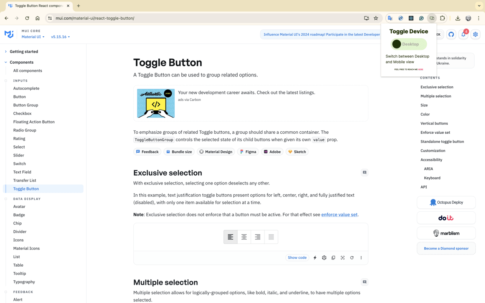
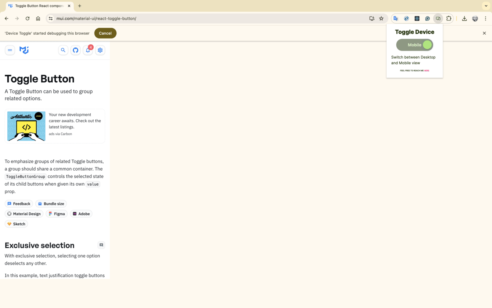

# Device toggle

### Description:

This project provides a simple switch to toggle between Desktop (larger viewports) and Mobile (375x812) views in a Chrome extension. Designed for users who do not intend to utilize other devtools functionalities, it offers a straightforward approach to device emulation without the complexity of full developer tools. Built with React, TypeScript, and Vite, and styled using Material-UI with custom overrides, the extension simplifies the user experience for those seeking just the device toggle feature.

🖥️
```sh
size: User's viewport
```
📱
```sh
size: 375 x 812 (iPhone X)
```
### Project Purpose:

The Device Toggle extension was designed to assist my colleagues in customer support by providing a simple way to access the browser's device emulation feature. This extension streamlines the process, eliminating complexity and focusing on an improved user interface without requiring multiple clicks to access developer tools. Its goal is to enhance our work by allowing for easy switching between desktop and mobile views, aiding in tailoring support according to the customer's needs and providing visual examples as a work tool.P

## Running the project

### Clone the repository:

```sh
git clone https://github.com/gusmagnago/device-toggle-chrome-ext.git
```

### Install dependencies:

```sh
npm install
```

### Run the project in development mode:

```sh
npm run dev
```
This will start the development server. You can view the project in your browser at http://localhost:3000.

## Building the Project:
To build the project and update the code in the extension:
```sh
npm run build
```

## Technologies Used

- JavaScript
- React
- Typescript
- Material-UI
- Vite

## Privacy Policy

Read our [Privacy Policy](https://github.com/gusmagnago/device-toggle-chrome-ext/blob/main/privacyPolicy.md) here

### Examples:

*The first image shows the extension in the default browser state, before any toggling is performed.*

*The second image shows the extension after toggling, with the view switched to mobile (375x812).*

### Thank you 📲

### Gustavo Magnago
*Feel free to comment or suggest better versions*